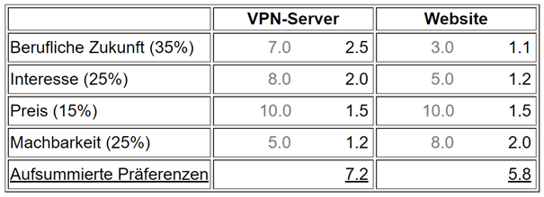

# E (Entscheiden)

## Nutzwertanalyse
----

----

### Berufliche Zukunft:
 - Wir haben uns dazu entschieden, dass der VPN-Server für unsere Berfuliche Zukunft relevanter ist, als eine Webseite. Dies kommt daher, da Herr Landolt, möglicherweise in der Zukunft, im Betrieb mit VPNs in Kontakt kommen wird und Herr Mala schon im Betrieb mit VPNs zutun hatte.
  
 - Wir haben uns gegen die Website entschieden, da wir beide im Betrieb nicht mit Webseiten zutun haben.

### Interesse:
 - Herr Malas Interesse, für VPN-Server, wurde bei Ihm schon im Büro geweckt. Und Herr Landolt wollte auch mal ein Einblick in die VPNs bekommen.

### Preis:
- Da uns schon zwei Raspberry PIs zur Verfügung stehen, müssen wir in keine Materialien investieren. Die Domain für die Website, wäre ebenfalls schon vorhanden.

### Machbarkeit:
- Da wir beide schon Webseiten erstellt haben(Jimdo, WordPress, etc.), haben wir uns schon ungefähr mit dem Thema auseinander gesetzt. Wir wollten nun eine Challenge einbauen und die Webseite selber hosten.

- Das Aufsetzen eines VPN-Servers ist zwar schwieriger, aber da dieses Projekt unser Interessen geweckt hat, haben wir uns trotzdem für dieses entschieden.