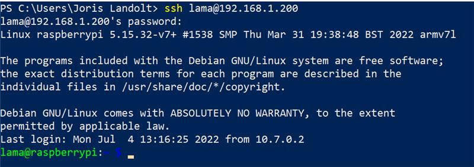
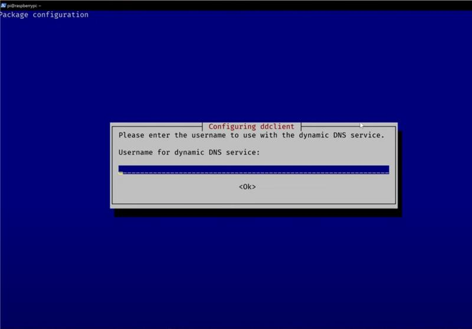

# R (Realisieren)
## Betriebssystem auf SDK installiert.
- Hardware: Raspberry Pi 3 Model B Rev 1.2
- Betriebsystem: Raspberry Pi OS Lite
- Image mit rufus auf SD-Karte geladen.

## Statische IP vergeben
 - sudo nano /etc/dhcpcd.conf

## SSH Dienst installiert und konfiguriert
 - sudo apt install openssh-server -y

## SSH verbindung aufgebaut und getestet
 - ssh lama@192.168.1.200 (Raspberry PI)
 

## Dyn-DNS Grundeinrichtung

----

### Dyn-DNS Account erstellen

----

### Gratis Subdomain
- http://freedns.afraid.org/subdomain/

----

## Einrichtung DynDns
### sudo apt install ddclient

 - Enter drücken, bis das Programm sich schliesst.

----

### sudo nano /etc/ddclient/.conf

 - Muss mit den Login-Daten des DynDNS übereinstimmen.

----

### sudo nano /etc/default/ddclient

 - Daemon Einstellungen übernehmen

----

### sudo systemctl restart ddclient
### sudo systemctl status client

 - Dyn-DNS Client neu starten und den Status anzeigen

----

### Subdomain überprüfen
 - http://freedns.afraid.org/subdomain/

 - Subdomain wird nun WAN-IP anzeigen
  
----

## VPN Serverdienst installation (Wireguard)
 - wget https://git.io/wireguard -O wireguard-install.sh && sudo bash wireguard-install.sh

