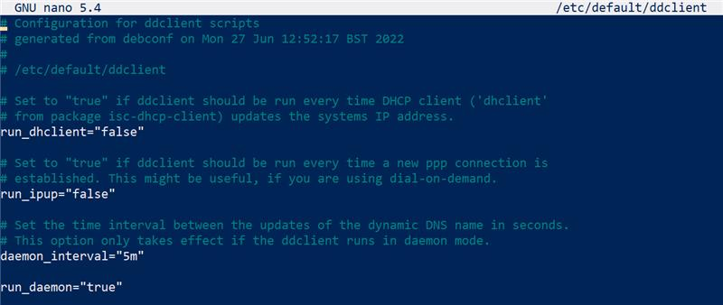

# R (Realisieren)

- [R (Realisieren)](#r-realisieren)
  - [Betriebssystem auf SDK installiert.](#betriebssystem-auf-sdk-installiert)
  - [Statische IP vergeben](#statische-ip-vergeben)
  - [SSH Dienst installiert und konfiguriert](#ssh-dienst-installiert-und-konfiguriert)
  - [SSH verbindung aufgebaut und getestet](#ssh-verbindung-aufgebaut-und-getestet)
  - [Dyn-DNS Grundeinrichtung](#dyn-dns-grundeinrichtung)
    - [Dyn-DNS Account erstellen](#dyn-dns-account-erstellen)
    - [Gratis Subdomain](#gratis-subdomain)
  - [Einrichtung DynDns](#einrichtung-dyndns)
    - [sudo apt install ddclient](#sudo-apt-install-ddclient)
    - [sudo nano /etc/ddclient/.conf](#sudo-nano-etcddclientconf)
    - [sudo nano /etc/default/ddclient](#sudo-nano-etcdefaultddclient)
    - [sudo systemctl restart ddclient](#sudo-systemctl-restart-ddclient)
    - [sudo systemctl status client](#sudo-systemctl-status-client)
    - [Subdomain überprüfen](#subdomain-überprüfen)
  - [Portforwardings](#portforwardings)
  - [VPN Serverdienst installation](#vpn-serverdienst-installation)
    - [Wireguard installieren](#wireguard-installieren)
    - [Wireguard konfigurieren](#wireguard-konfigurieren)
  - [QR-Code für mobile Verbindungen](#qr-code-für-mobile-verbindungen)
  - [.conf File extrahieren](#conf-file-extrahieren)
    - [SFTP Verbindung mit SSH Programm aufbauen](#sftp-verbindung-mit-ssh-programm-aufbauen)
    - [Config File extrahieren](#config-file-extrahieren)

## Betriebssystem auf SDK installiert.
- Hardware: Raspberry Pi 3 Model B Rev 1.2
- Betriebsystem: Raspberry Pi OS Lite
- Image mit rufus auf SD-Karte geladen.

## Statische IP vergeben
 - sudo nano /etc/dhcpcd.conf

## SSH Dienst installiert und konfiguriert
 - sudo apt install openssh-server -y

## SSH verbindung aufgebaut und getestet
 - ssh lama@192.168.1.200 (Raspberry PI)
 

## Dyn-DNS Grundeinrichtung

----

### Dyn-DNS Account erstellen

----

### Gratis Subdomain
- http://freedns.afraid.org/subdomain/

----

## Einrichtung DynDns
### sudo apt install ddclient

 - Enter drücken, bis das Programm sich schliesst.

----

### sudo nano /etc/ddclient/.conf

 - Muss mit den Login-Daten des DynDNS übereinstimmen.

----

### sudo nano /etc/default/ddclient

 - Daemon Einstellungen übernehmen

----

### sudo systemctl restart ddclient
### sudo systemctl status client

 - Dyn-DNS Client neu starten und den Status anzeigen

----

### Subdomain überprüfen
 - http://freedns.afraid.org/subdomain/

 - Subdomain wird nun WAN-IP anzeigen
  
----

## Portforwardings
 - Da wir keinen Zugriff auf den Heim-Router von Herr Landolt haben, hat der Freund seiner Mutter uns die Port-Forwardings eingerichet
 - Port: 51820
  
  ----

## VPN Serverdienst installation
### Wireguard installieren

 - wget https://git.io/wireguard -O wireguard-install.sh && sudo bash wireguard-install.sh

 ----

### Wireguard konfigurieren

 - sudo bash wireguard-install.sh

----

## QR-Code für mobile Verbindungen

 - Wird automatisch nach dem letzen Schritt angezeigt
  

----

## .conf File extrahieren
### SFTP Verbindung mit SSH Programm aufbauen

----

### Config File extrahieren

 - /root/ Verzeichnis

----

